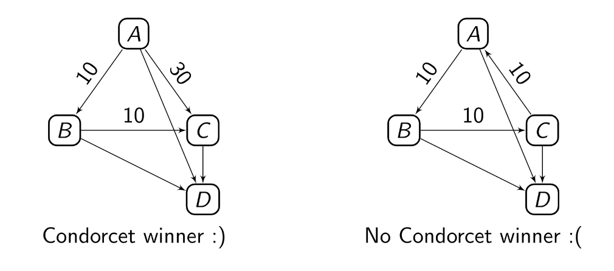

# electoral-systems

This repository contains my work for a project in my Game Theory in Computer Science course at GWU. The project presentation (`project_presentation.pdf`) is included, as well as the source code for running simulations of elections to compare three electoral systems: plurality, instant-runoff voting, and the GT-Method. 

## Condorcet Winners
A useful idea when analyzing voting systems is that of a Condorcet Winner. This is a winner who, when put in a contest with each other candidate in a race, would win head-to-head. We can represent a race by a directed graph where candidates are nodes, and directed edges point from winner to loser and are weighted by the margin that the corresponding head-to-head race would reveal. Such graphs can be constructed entirely from truthful rankings of the candidates in the race, where difference in ranking shows the prefered candidate when tallying head-to-head races. See the example below. 

On the left we have a Condorcet winner because candidate A defeats all other candidates. On the right we have a Condorcet tie because no Condorcet winner exists; A beats B beats C. The Smith set, {A, B, C} consists of all the 'best' candidates in the sense that they are in a Condorcet tie with each other, but they all beat all other candidates in the race (D in this case). In the example on the left, the Smith set is {A}, consisting only of a Condorcet winner; in general a Condorcet winner exists when the size of the Smith set is 1.

## GT-Method
As presented by Rivest and Shen in [An Optimal Single-Winner Preferential Voting System Based on
Game Theory](https://www.stat.uchicago.edu/~lekheng/meetings/mathofranking/ref/rivest.pdf), the GT-Method is a really interesting approach to the problem of choosing a winner of an election using a pool of ballots, rankings of the candidates in order of preference. The GT-Method frames the choice as a game. Suppose two voting-systems would choose a different candidate, then whichever system selects the candidate who would win between the two in a hypothetical head-to-head election wins the margin of that hypothetical election as its payoff. Imagine playing this game over and over, and an optimal strategy emerges in the form of a probability distribution over the candidates. For example, if there is a Condorcet winner (one who beats all other candidates in a head-to-head contest), then the distribution is simply 1 for that candidate, and 0 for all others. Clearly this is the optimal strategy because any other candidate loses to this candidate. Such an optimal strategy always exists, and we can find it by solving a simple linear programming problem. This is a really nice solution to the problem of choosing a winner since it guarantees that, on average, it will pick a candidate which is prefered by the voters; this is a reasonable objective.
### Downsides
Perhaps a downside to the GT-Method is that a winner to the election is chosen by random chance whenever a Condorcet tie exists. Rivest and Shen argue that a public 'tie-breaking ceremony' could be used, and they point out that random chance has been used in some small contest decisions before. While random chance does achieve optimality, it may be difficult to become popular on a large scale because a deterministic choice feels a bit more natural and fair regardless of what the math says.

## Results
There were cases in which a plurality election failed to select the most popular candidate, while the others did so. 

